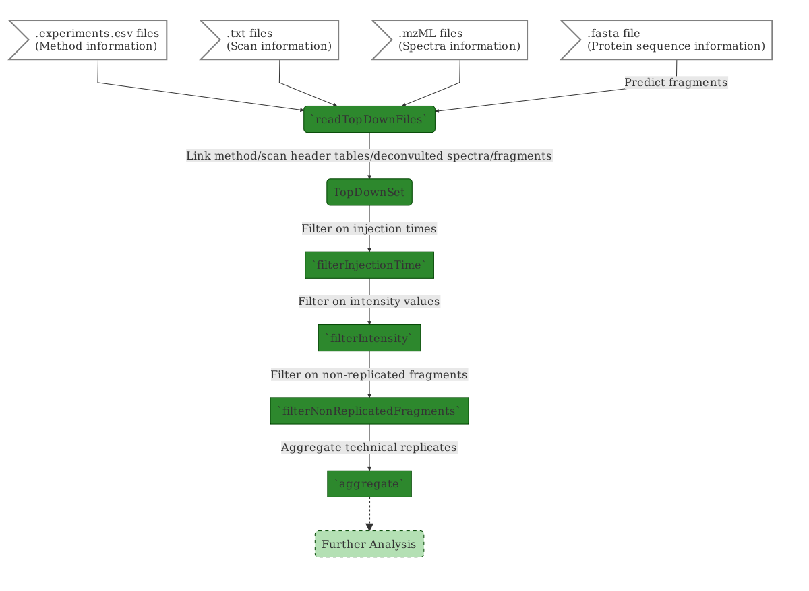
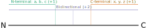

```{r environment, echo=FALSE, message=FALSE, warning=FALSE}
library("topdownr")
library("topdownrdata")
library("ranger")
library("ggplot2")
library("BiocStyle")
```

# Foreword {-}

`r BiocStyle::Biocpkg("topdownr")` is free and
open-source software. If you use it, please support the project by
citing it in publications:

```{r citation, echo=FALSE, results="asis"}
ct <- format(citation("topdownr"), "textVersion")
cat(gsub("DOI: *(.*)$", "DOI: [\\1](https://doi.org/\\1)", ct), "\n")
```

# Questions and bugs {-}

For bugs, typos, suggestions or other questions, please file an issue
in our tracking system (https://github.com/sgibb/topdownr/issues)
providing as much information as possible, a reproducible example and
the output of `sessionInfo()`.

If you don't have a GitHub account or wish to reach a broader audience
for general questions about proteomics analysis using R, you may want
to use the Bioconductor support site: https://support.bioconductor.org/.

# Introduction/Working with `topdownr`

Load the package.

```{r loadPackage}
library("topdownr")
```

## Importing Files

Some example files are provided in the `topdownrdata` package. For a full
analysis you need a `.fasta` file with the protein sequence, the
`.experiments.csv` files containing the method information, the `.txt` files
containing the scan header information and the `.mzML` files with the
deconvoluted spectra.

```{r listFiles, eval=-1, echo=1, comment=NA}
list.files(topdownrdata::topDownDataPath("myoglobin"))
lapply(
    topdownr:::.listTopDownFiles(
        topdownrdata::topDownDataPath("myoglobin")),
    function(x) {
        c(head(
            file.path(
                "...",
                paste(
                    tail(strsplit(dirname(x), "/")[[1L]], 2),
                    collapse=.Platform$file.sep
                ),
                basename(x)
            ),
            2
        ), "...")
    }
)
```

All these files have to be in a directory. You could import them via
`readTopDownFiles`. This function has some arguments. The most important ones
are the `path` of the directory containing the files,
the protein `modification` (e.g. initiator methionine removal,
`"Met-loss"`), and adducts (e.g. proton transfer often occurs
from c to z-fragment after ETD reaction).

```{r importFiles, warnings=FALSE}
## the mass adduct for a proton
H <- 1.0078250321

myoglobin <- readTopDownFiles(
    ## directory path
    path = topdownrdata::topDownDataPath("myoglobin"),
    ## fragmentation types
    type = c("a", "b", "c", "x", "y", "z"),
    ## adducts (add -H/H to c/z and name
    ## them cmH/zpH (c minus H, z plus H)
    adducts = data.frame(
        mass=c(-H, H),
        to=c("c", "z"),
        name=c("cmH", "zpH")),
    ## initiator methionine removal
    modifications = "Met-loss",
    ## don't use neutral loss
    neutralLoss = NULL,
    ## tolerance for fragment matching
    tolerance = 5e-6,
    ## topdownrdata was generate with an older version of topdownr,
    ## the method files were generated with FilterString identification,
    ## use `conditions = "ScanDescription"` (default) for recent data.
    conditions = "FilterString"
)

myoglobin
```

## The `TopDownSet` Anatomy

The assembled object is an `TopDownSet` object.
Briefly it is composed of three interconnected tables:

1. `rowViews`/*fragment data*: holds the information on the type of fragments,
    their modifications and adducts.
2. `colData`/*condition data*: contains the corresponding fragmentation
    condition for every spectrum.
3. `assayData`: contains the intensity of assigned fragments.

![TopDownSet anatomy, image adopted from [@SummarizedExperiment].](images/TopDownSet.svg)

## Technical Details

This section explains the implementation details of the `TopDownSet` class. It
is not necessary to understand everything written here to use `topdownr` for the
analysis of fragmentation data.

The `TopDownSet` contains the following components: *Fragment data*, *Condition
data*, *Assay data*.

### Fragment data

```{r rowViews}
rowViews(myoglobin)
```

The fragmentation data are represented by an `FragmentViews` object that is an
overloaded `XStringViews` object. It contains one `AAString`
(the protein sequence) and an `IRanges` object that stores the
`start`, `end` (and `width`) values of the fragments.
Additionally it has a `DataFrame` for the `mass`, `type` and `z` information
of each fragment.

### Condition data

```{r colData}
conditionData(myoglobin)[, 1:5]
```

Condition data is a `DataFrame` that contains the combined header information
for each MS run (combined from method (`.experiments.csv` files)/scan header
(`.txt` files) table and metadata from the `.mzML` files).

### Assay data

```{r assayData}
assayData(myoglobin)[206:215, 1:10]
```

Assay data is a `sparseMatrix` from the `Matrix` package
(in detail a `dgCMatrix`) where the rows correspond to the fragments,
the columns to the runs/conditions and the entries to the intensity values.
A `sparseMatrix` is similar to the classic `matrix` in *R* but stores just
the values that are different from zero.

## Subsetting a `TopDownSet`

A `TopDownSet` could be subsetted by the fragment and the condition data.

```{r subsetting}
# select the first 100 fragments
myoglobin[1:100]

# select all "c" fragments
myoglobin["c"]

# select just the 100. "c" fragment
myoglobin["c100"]

# select all "a" and "b" fragments but just the first 100 "c"
myoglobin[c("a", "b", paste0("c", 1:100))]

# select condition/run 1 to 10
myoglobin[, 1:10]

# select all conditions from one file
myoglobin[, myoglobin$File == "myo_1211_ETDReagentTarget_1e+06_1"]

# select all "c" fragments from a single file
myoglobin["c", myoglobin$File == "myo_1211_ETDReagentTarget_1e+06_1"]
```

## Plotting a `TopDownSet`

Each condition represents one spectrum. We could plot a single condition
interactively or all spectra into a `pdf` file
(or any other *R* device that supports multiple pages/plots).

```{r plotting, eval=1:2}
# plot a single condition
plot(myoglobin[, "C0707.30_1.0e+05_1.0e+06_10.00_00_28_3"])
# example to plot the first ten conditions into a pdf
# (not evaluated in the vignette)
pdf("topdown-conditions.pdf", paper="a4r", width=12)
plot(myoglobin[, 1:10])
dev.off()
```

`plot` returns a `list` (an item per condition) of `ggplot` objects which could
further modified or investigated interactively by calling `plotly::ggplotly()`.

# Fragmentation Data Analysis of Myoglobin

We follow the following workflow:



We use the example data loaded in
[Importing Files](analysis.html#21_importing_files).

```{r importFiles2, ref.label="import_files", eval=FALSE}
```

The data contains several replicates for each fragmentation condition.
Before aggregation can be performed we need to remove scans with
inadequate injection times and fragments with low intensity or poor
intensity reproducibility.

## Filter Conditions on Injection Times

Injection times should be consistent for a particular *m/z* and particular
AGC target. High or low injection times indicate problems with on-the-flight
AGC calculation or spray instability for a particular scan. Hence the
`topdownr` automatically calculates median injection time for a given *m/z*
and AGC target combination. The user can choose to remove all scans that
deviate more than a certain amount from the corresponding median and/or
choose to keep `N` scans with the lowest deviation from the median for
every condition.

Here we show an example of such filtering and the effect on the distribution of
injection times.

```{r filterInjectionTimes}
injTimeBefore <- colData(myoglobin)
injTimeBefore$Status <- "before filtering"

## filtering on max deviation and just keep the
## 2 technical replicates per condition with the
## lowest deviation
myoglobin <- filterInjectionTime(
    myoglobin,
    maxDeviation = log2(3),
    keepTopN = 2
)

myoglobin

injTimeAfter <- colData(myoglobin)
injTimeAfter$Status <- "after filtering"

injTime <- as.data.frame(rbind(injTimeBefore, injTimeAfter))

## use ggplot for visualisation
library("ggplot2")

ggplot(injTime,
    aes(x = as.factor(AgcTarget),
        y = IonInjectionTimeMs,
        group = AgcTarget)) +
    geom_boxplot() +
    facet_grid(Status ~ Mz)
```

## Filter Fragments on CV

High CV of intensity for a fragment suggests either fragment contamination
by another *m/z* species or problems with deisotoping and we recommend
removing all fragments with CV > 30, as shown below.

```{r filterCv}
myoglobin <- filterCv(myoglobin, threshold=30)
myoglobin
```

## Filter Fragments on Intensity

When optimizing protein fragmentation we also want to focus on the most
intense fragments, hence we recommend removing all low intensity fragments
from analysis.

Low intensity is defined relatively to the most intense observation for
this fragment (i.e. relatively to the maximum value in an `assayData` row).
In the example below all intensity values, which have less than 10%
intensity of the highest intensity to their corresponding fragment
(in their corresponding row) are removed.

```{r filterIntensity}
myoglobin <- filterIntensity(myoglobin, threshold=0.1)
myoglobin
```

## Data Aggregation

The next step of analysis is aggregating technical replicates of fragmentation
conditions (columns of `assayData`).

```{r aggregate}
myoglobin <- aggregate(myoglobin)
myoglobin
```

## Random Forest

To examine which of the features (fragmentation parameters) have the highest
overall impact for a protein we perform random forest machine learning using the
`ranger` [@ranger] `R`-package.

Before we compute some fragmentation statistics
(number of assigned fragments, total assigned intensity, etc.).

```{r randomForest}
library("ranger")

## statistics
head(summary(myoglobin))

## number of fragments
nFragments <- summary(myoglobin)$Fragments

## features of interest
foi <- c(
    "AgcTarget",
    "EtdReagentTarget",
    "EtdActivation",
    "CidActivation",
    "HcdActivation",
    "Charge"
)

rfTable <- as.data.frame(colData(myoglobin)[foi])

## set NA to zero
rfTable[is.na(rfTable)] <- 0

rfTable <- as.data.frame(cbind(
    scale(rfTable),
    Fragments = nFragments
))

featureImportance <- ranger(
    Fragments ~ .,
    data = rfTable,
    importance = "impurity"
)$variable.importance

barplot(
    featureImportance/sum(featureImportance),
    cex.names = 0.7
)
```

The two parameters having the lowest overall impact in the `myoglobin`
dataset across all conditions are ETD reagent target (`EtdReagentTarget`),
CID activation energy (`CidActivation`) and AGC target (`AgcTarget`),
while ETD reaction energy (`EtdActivation`) and HCD activation energy
(`HcdActivation`) demonstrate the highest overall impact.

## Combining Fragmentation Conditions to Maximize Coverage

The purpose of `topdownr` is to investigate how maximum coverage with high
intensity fragments can be achieved with minimal instrument time.
Therefore `topdownr` reports the best combination of fragmentation conditions
(with user specified number of conditions) that covers the highest number of
different bonds.

Different fragmentation methods predominantly generate different types of
fragments (e.g. b and y for HCD and CID, c and z for ETD, a and x for UVPD).

However N-terminal (a, b and c) as well as C-terminal (x, y and z) fragments
originating from the same bond, cover the same number of amino acid sidechains.
Hence different types of N-terminal (a, b and c) or C-terminal (x, y and z)
fragments from the same bond add no extra sequence information.

Before we compute combinations all the fragments are converted to either
N- or C-terminal, as shown in the image below.



In `topdownr` we convert the `TopDownSet` into an `NCBSet` object
(*N*-terminal/*C*-terminal/*B*idirectional).

```{r coerce2NCBSet}
myoglobinNcb <- as(myoglobin, "NCBSet")
myoglobinNcb
```

An `NCBSet` is very similar to a `TopDownSet` but instead of an `FragmentViews`
the `rowViews` are an `XStringViews` for the former. Another difference is that
the `NCBSet` has one row per bond instead one row per fragment. Also the
`assayData` contains no intensity information but a `1` for an *N*-terminal, a
`2` for a *C*-terminal and a `3` for bidirectional fragments.

The `NCBSet` can be used to select the combination of conditions that provide
the best fragment coverage. While computing coverage `topdownr` awards 1 point
for every fragment going from every bond in either *N* or *C* directions.
This means that bonds covered in both directions increase the score of a
condition by 2 points.
For the myoglobin fragmentation example we get the following table for the best
three conditions:

```{r bestConditions}
bestConditions(myoglobinNcb, n=3)
```

## Building a Fragmentation Map

Fragmentation maps allow visualising the type of fragments produced by
fragmentation conditions and their overall distribution along the protein
backbone. It also illustrates how the combination of conditions results in
a cumulative increase in fragment coverage.
Shown below is a fragmentation map for myoglobin *m/z* 707.3, AGC target `1e6`
and ETD reagent target of `1e7` for ETD
(plotting more conditions is not practical for the vignette):

```{r fragmentationMap}
sel <-
    myoglobinNcb$Mz == 707.3 &
    myoglobinNcb$AgcTarget == 1e6 &
    (myoglobinNcb$EtdReagentTarget == 1e7 &
     !is.na(myoglobinNcb$EtdReagentTarget))

myoglobinNcbSub <- myoglobinNcb[, sel]

fragmentationMap(
    myoglobinNcbSub,
    nCombinations = 10,
    labels = seq_len(ncol(myoglobinNcbSub))
)
```

# Session Information

```{r sessionInfo}
sessionInfo()
```

# References
